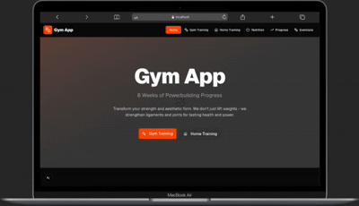

<div align="center">
  
</div>


# Gym App

## Project Title & Description

The Gym App is a comprehensive fitness application designed to help users track their gym and home workouts, manage nutrition, and monitor their progress. It features an 8-week powerbuilding program with detailed exercise instructions, dynamic workout scheduling, and user authentication.

## Features

* **User Authentication:** Secure login, registration, and password reset functionalities.
* **Dynamic Training Programs:**
  * 8-week Gym Training Program with detailed daily workouts.
  * 8-week Home Training Program focusing on bodyweight and calisthenics.
  * Dynamic routing for weeks and individual workout days.
* **Exercise Library:** A comprehensive list of exercises with individual detail pages, including placeholders for GIFs and videos.
* **Progress Tracking:** (Planned/Basic implementation) Ability to track user progress over time.
* **Nutrition Guidance:** (Planned/Basic implementation) Pages for nutrition, meal plans, and PFC basics.
* **Responsive UI:** Built with Next.js, React, and Tailwind CSS for a modern and responsive user experience.

## Technologies Used

* **Framework:** Next.js (App Router)
* **Language:** TypeScript
* **Styling:** Tailwind CSS, PostCSS, `tw-animate-css`
* **UI Components:** Shadcn UI
* **Database:** SQLite with Drizzle ORM
* **Authentication:** `jose` for JWT management, `bcryptjs` for password hashing.
* **Icons:** Lucide React

## Getting Started

Follow these instructions to set up and run the project locally.

### Prerequisites

* Node.js (v18 or higher)
* npm or pnpm

### Installation

1. **Clone the repository:**

   ```bash
   git clone <repository-url>
   cd gym-app
   ```
2. **Install dependencies:**

   ```bash
   npm install
   # or pnpm install
   ```

### Database Setup

This project uses SQLite as its database and Drizzle ORM for database interactions. The database file (`gym-app.db`) will be created automatically.

1. **Initialize the database and seed exercises:**
   The database tables are initialized when the application starts. To populate the `exercises` table with the workout program data, run the seeding script:

   ```bash
   npx ts-node scripts/seed-exercises.ts
   ```

   This script will create the `gym-app.db` file if it doesn't exist and populate the `exercises` table. It also ensures that the in-memory workout programs (`gymProgram`, `homeProgram`) have exercise IDs assigned.

### Running the Development Server

To start the Next.js development server:

```bash
npm run dev
# or pnpm dev
```

Open [http://localhost:3000](http://localhost:3000) in your browser to see the application.

### Building for Production

To build the application for production:

```bash
npm run build
# or pnpm build
```

To start the production server:

```bash
npm run start
# or pnpm start
```

## Project Structure

* `app/`: Contains Next.js App Router pages, layouts, and API routes.
  * `app/api/auth/`: Authentication API endpoints.
  * `app/gym-training/`: Dynamic routes for gym training programs.
  * `app/home-training/`: Dynamic routes for home training programs.
  * `app/exercises/`: Dynamic routes for individual exercise details and the exercise library.
  * `app/login/`, `app/register/`, `app/reset-password/`: Authentication UI pages.
* `components/`: Reusable React components, including Shadcn UI components.
* `lib/`: Utility functions, database configuration, Drizzle schema, and workout program data.
  * `lib/db/`: Database connection, schema, and query functions.
  * `lib/auth.ts`: Server-side authentication logic.
  * `lib/gym-workouts.ts`, `lib/home-workouts.ts`: Static data for training programs.
* `public/`: Static assets like images.
* `scripts/`: Utility scripts, e.g., `seed-exercises.ts`.

## Authentication

The application includes basic user authentication:

* **Login:** Users can sign in with their email and password.
* **Registration:** New users can create an account.
* **Password Reset:** Functionality to request a password reset link (email sending is currently simulated in the console).

## Training Programs

The core of the app revolves around structured 8-week training programs:

* **Gym Training:** Focuses on powerbuilding with barbell and dumbbell exercises.
* **Home Training:** Emphasizes bodyweight and calisthenics.

Each program is broken down by week and then by individual workout days. Users can navigate through weeks and days to view specific exercise routines.

## Exercise Library

The `/exercises` page provides a comprehensive list of all exercises. Clicking on an exercise will lead to a detailed page (`/exercises/[id]`) showing its description, instructions, muscles worked, and placeholders for video/GIF demonstrations.

## Contributing

Contributions are welcome! Please feel free to open issues or submit pull requests.

## License

This project is licensed under the MIT License.

## Project images


<div align="center">
  
</div>
